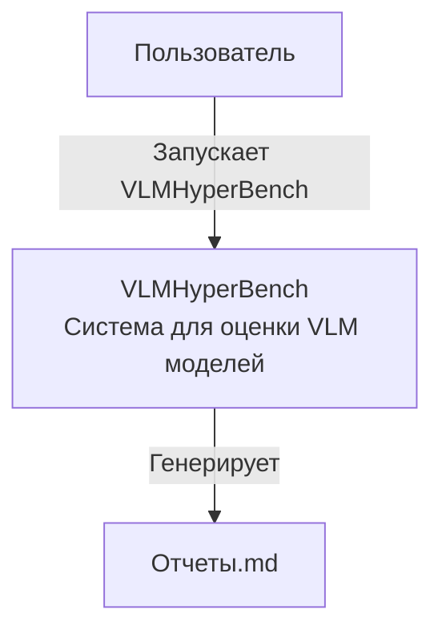
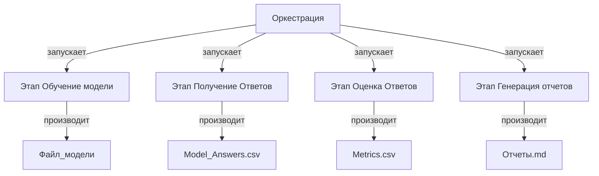
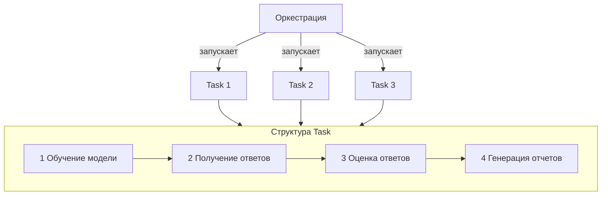
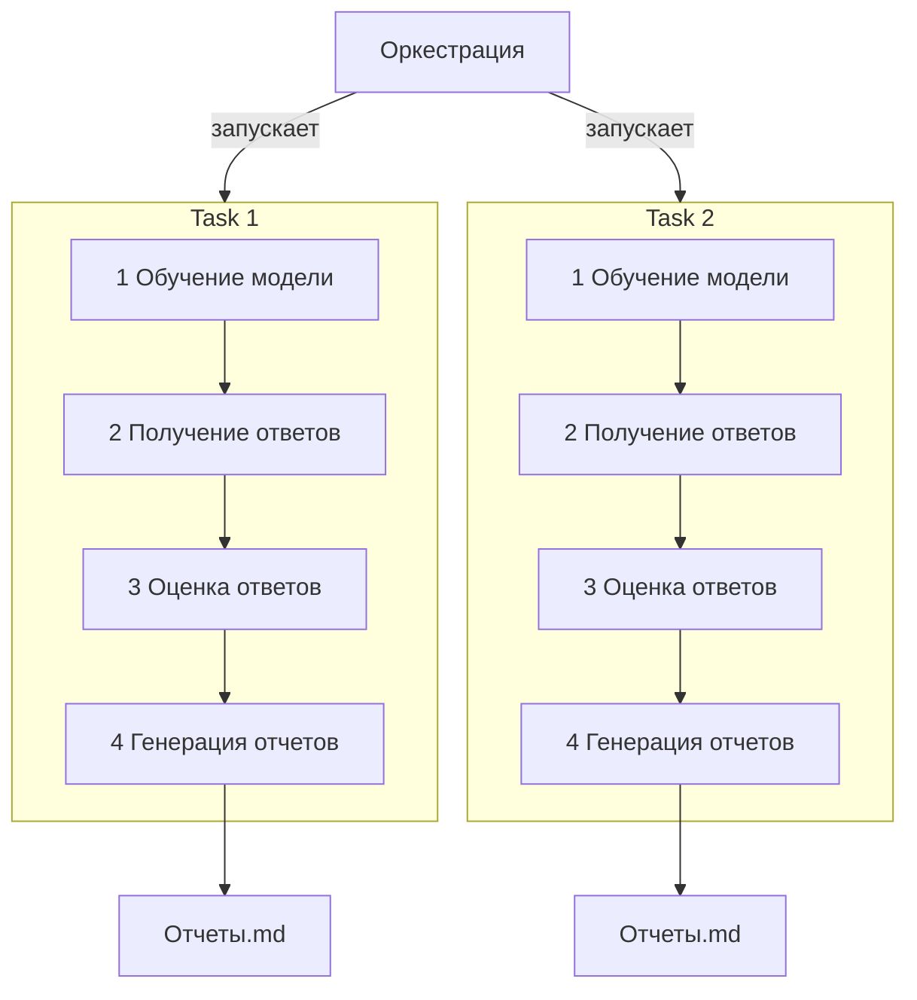
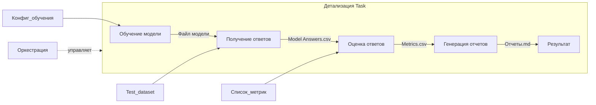
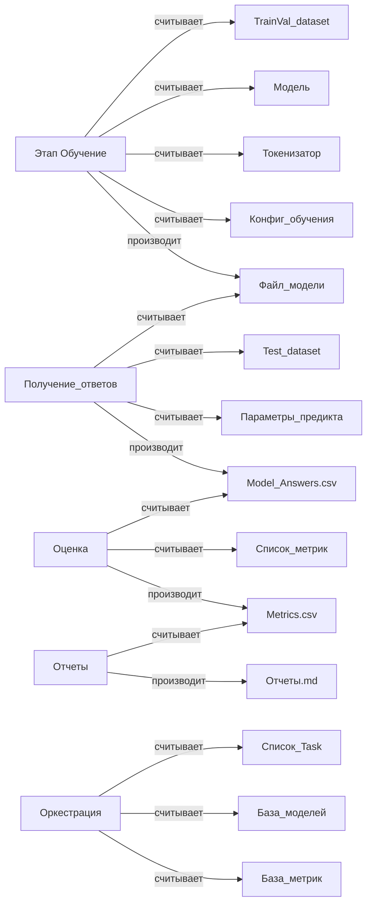

---
Author:
  - Ширяев Антон
  - DeepSeek-R1
tags:
  - архитектура
date: 2025-07-12
---
### 1. Контекст системы (C4 Level 1)

### 2. Контейнеры и процессы (C4 Level 2)

### Концепция Task

Концепция **Task** или Задач.

###  Детализированное представление (показывает последовательность)

### Необязательность этапов каждого Task.

[Исходник диаграммы](/docs/architecture/optionality_of_each_stage_in_the_Task.puml)

### Дополнительно: Диаграмма уровня 3 (детализация одного Task)

### 3. Детализация данных (C4 Level 3)# Название заметки

