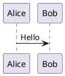

# Лучшие практики использования PlantUML

## Содержание
- [Структура хранения файлов](#структура-хранения-файлов)
- [Автоматизация рендеринга](#автоматизация-рендеринга)
- [Удалённый рендеринг](#удалённый-рендеринг)
- [Документирование связей](#документирование-связей)
- [Git и ревью](#git-и-ревью)
- [Примеры автоматизации](#примеры-автоматизации)
- [Интеграция с GitHub/GitLab](#интеграция-с-githubgitlab)

---

## Структура хранения файлов

### Рекомендуемая структура
```
docs/
  architecture/
    diagrams/
      my-diagram.puml
      my-diagram.svg
    README.md
    another-doc.md
```

### Принципы организации
- **Храните исходники (`.puml`) отдельно от сгенерированных изображений (`.svg` или `.png`)**
- Используйте отдельную папку для диаграмм
- В Markdown-файлах вставляйте SVG/PNG через относительный путь:
  ```markdown
  
  ```

### Документирование использования
В начале каждого `.puml`-файла указывайте, где он используется:


---

## Автоматизация рендеринга

### Bash-скрипт для автоматической генерации
```bash
#!/bin/bash
# generate-diagrams.sh

DIAGRAMS_DIR="docs/architecture/diagrams"

# Генерируем SVG из всех .puml файлов
for f in "$DIAGRAMS_DIR"/*.puml; do
    if [ -f "$f" ]; then
        echo "Генерируем SVG для: $f"
        plantuml -tsvg "$f"
    fi
done

echo "Генерация завершена!"
```

### Makefile для автоматизации
```makefile
DIAGRAMS=$(wildcard docs/architecture/diagrams/*.puml)
SVG=$(DIAGRAMS:.puml=.svg)

.PHONY: all clean

all: $(SVG)

%.svg: %.puml
	plantuml -tsvg $<

clean:
	rm -f docs/architecture/diagrams/*.svg
```

### NPM-скрипт (если используете Node.js)
```json
{
  "scripts": {
    "diagrams": "find docs/architecture/diagrams -name '*.puml' -exec plantuml -tsvg {} \\;",
    "diagrams:watch": "nodemon --watch docs/architecture/diagrams --ext puml --exec 'npm run diagrams'"
  }
}
```

---

## Удалённый рендеринг

### Онлайн-сервисы
- **[plantuml.com/plantuml](http://www.plantuml.com/plantuml/)** - официальный сервер
- **[Kroki](https://kroki.io/)** - универсальный сервер для диаграмм

### Прямая ссылка на сгенерированное изображение
```markdown

```

### Прокси-ссылка на .puml-файл в GitHub
```markdown

```

### Без кэширования (для актуальности)
```markdown

```

---

## Документирование связей

### В исходном файле диаграммы

```plantuml
' Используется в: docs/architecture/README.md
' Описание: Архитектура системы VLMHyperBench
' Автор: Имя Автора
' Дата создания: 2024-01-15
' Последнее обновление: 2024-01-20
@startuml
...
@enduml
```


### В документации
```markdown
## Архитектура системы


[Исходник диаграммы](./diagrams/vlmhyperbench-architecture.puml)
```

### Индекс диаграмм
Создайте файл `docs/architecture/diagrams/README.md`:
```markdown
# Диаграммы архитектуры

## Список диаграмм

| Диаграмма | Файл | Используется в | Описание |
|-----------|------|----------------|----------|
| Архитектура VLMHyperBench | `vlmhyperbench-architecture.puml` | `../README.md` | Общая архитектура системы |
| Task Flow | `task-flow.puml` | `../task-description.md` | Поток выполнения задач |

## Генерация изображений

```bash
# Генерировать все диаграммы
make

# Генерировать конкретную диаграмму
plantuml -tsvg vlmhyperbench-architecture.puml
```
```

---

## Git и ревью

### Рекомендации для Git
- **Храните и исходники, и сгенерированные SVG/PNG в репозитории**
- Это позволяет видеть diff и для кода диаграммы, и для картинки
- В pull request удобно видеть, что изменилось

### .gitignore
```gitignore
# Исключаем временные файлы PlantUML
*.tmp
*.log

# Но НЕ исключаем сгенерированные SVG/PNG
# docs/architecture/diagrams/*.svg
# docs/architecture/diagrams/*.png
```

### Pre-commit hooks
```bash
#!/bin/bash
# .git/hooks/pre-commit

# Проверяем, что все .puml файлы имеют соответствующие .svg
for puml_file in docs/architecture/diagrams/*.puml; do
    svg_file="${puml_file%.puml}.svg"
    if [ ! -f "$svg_file" ]; then
        echo "Ошибка: $puml_file не имеет соответствующего SVG файла"
        echo "Запустите: make"
        exit 1
    fi
done
```

---

## Примеры автоматизации

### GitHub Actions
```yaml
name: Generate PlantUML Diagrams

on:
  push:
    paths:
      - 'docs/architecture/diagrams/**/*.puml'

jobs:
  generate-diagrams:
    runs-on: ubuntu-latest
    steps:
      - uses: actions/checkout@v3

      - name: Setup Java
        uses: actions/setup-java@v3
        with:
          java-version: '11'

      - name: Download PlantUML
        run: |
          wget https://github.com/plantuml/plantuml/releases/download/v1.2023.10/plantuml-1.2023.10.jar

      - name: Generate SVG diagrams
        run: |
          java -jar plantuml-1.2023.10.jar -tsvg docs/architecture/diagrams/*.puml

      - name: Commit generated diagrams
        run: |
          git config --local user.email "action@github.com"
          git config --local user.name "GitHub Action"
          git add docs/architecture/diagrams/*.svg
          git commit -m "Auto-generate PlantUML diagrams" || exit 0
          git push
```

### Docker для локальной разработки
```dockerfile
FROM openjdk:11-jre-slim

RUN apt-get update && apt-get install -y \
    graphviz \
    wget \
    && rm -rf /var/lib/apt/lists/*

RUN wget https://github.com/plantuml/plantuml/releases/download/v1.2023.10/plantuml-1.2023.10.jar -O /plantuml.jar

ENTRYPOINT ["java", "-jar", "/plantuml.jar"]
```

---

## Интеграция с GitHub/GitLab

### GitHub
GitHub **не поддерживает нативный рендеринг PlantUML**. Используйте:
- Экспорт в PNG/SVG и вставка как изображение
- Прокси-ссылки на PlantUML сервер
- Kroki для динамического рендеринга

### GitLab
GitLab поддерживает PlantUML нативно в Markdown:
```markdown

```

### Альтернативы для GitHub
1. **Статический экспорт**: Генерируйте SVG/PNG локально и коммитьте в репозиторий
2. **Динамический рендеринг**: Используйте прокси-ссылки на PlantUML сервер
3. **Kroki**: Универсальный сервер для рендеринга диаграмм

---

## Полезные ссылки

- [Официальная документация PlantUML](https://plantuml.com/en/)
- [PlantUML Language Reference Guide](https://plantuml.com/guide)
- [PlantUML dev workflow and GitHub/GitLab integration](https://docs-as-co.de/news/plantuml-markdown-code-gitlab-github-integration/)
- [plantuml-setup: best practices](https://github.com/hoggmania/plantuml-setup)

---

## Заключение

Следуя этим практикам, вы сможете:
- Организованно хранить диаграммы рядом с документацией
- Автоматизировать процесс генерации изображений
- Поддерживать актуальность диаграмм в Git
- Удобно работать с диаграммами в команде
- Интегрировать PlantUML в различные платформы (GitHub, GitLab, Docusaurus)

**Главный принцип**: Держите диаграммы как можно ближе к коду и документации, автоматизируйте рутинные задачи, документируйте связи между файлами.