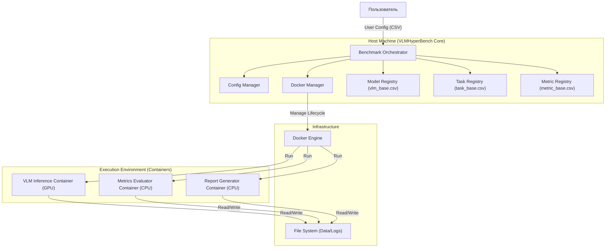
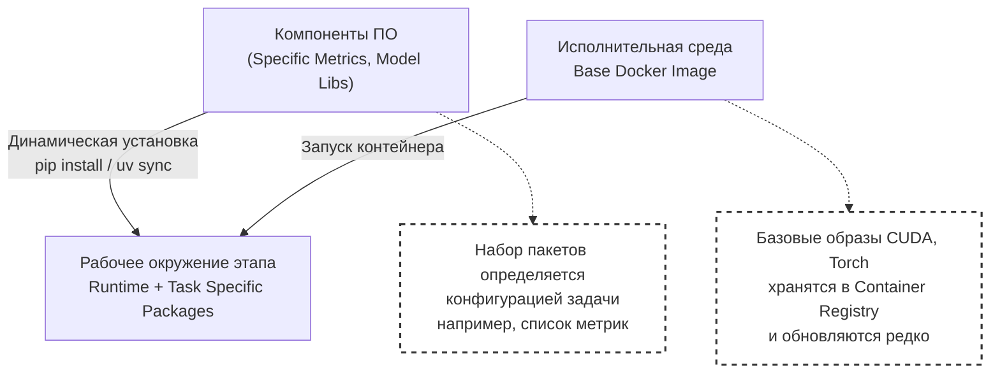
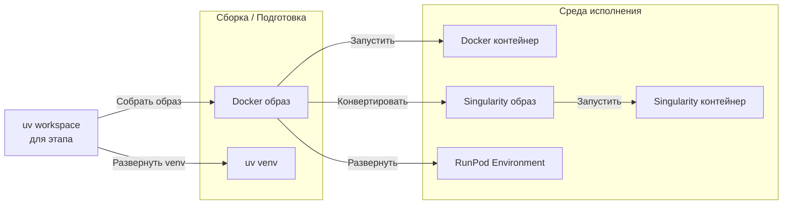

# Архитектурный дизайн прототипа VLMHyperBench

## 1. Обзор и Цели
**VLMHyperBench** — фреймворк для оценки Vision Language Models (VLM) с фокусом на задачи распознавания и анализа документов.
**Главная цель прототипа**: Обеспечить изолированный, воспроизводимый и расширяемый процесс тестирования моделей на различных датасетах.

## 2. Ключевые архитектурные принципы
1.  **Изоляция окружения (Environment Isolation)**: Каждая модель запускается в собственном Docker-контейнере для решения конфликтов зависимостей (CUDA, Python libs).
2.  **Микропакетная архитектура (Micro-packages)**: Функциональность разделена на независимые Python-пакеты (`bench-utils`, `model-interface`), управляемые через `uv workspaces`.
3.  **Модульность этапов (Stage Modularity)**: Разделение процесса на независимые этапы (Инференс -> Оценка -> Отчет), которые могут выполняться на разном оборудовании (GPU vs CPU).
4.  **Конфигурация как код (Configuration as Code)**: Полное описание эксперимента через конфигурационные файлы.

## 3. Компонентная Архитектура (C4 Level 2)

## 4. Детальное описание компонентов

### 4.1. Оркестратор (Host)
*   **Responsibility**: Чтение конфига, планирование очереди задач, запуск контейнеров, обработка ошибок.
*   **Logic**:
    1.  Parse `user_config.csv` и сопоставление с реестрами:
        *   `vlm_base.csv` (Модели)
        *   `task_base.csv` (Задачи: формат датасета, тип опросника)
        *   `metric_base.csv` (Метрики: тип оценщика)
    2.  Планирование задач (Scheduling):
        *   Поддержка **асинхронного запуска** задач.
        *   Распараллеливание инференса по доступным GPU (Multi-GPU support).
    3.  Prepare Volumes (mapping host paths to container paths).
    4.  Execute `Run VLM` stage (Inference).
    5.  Execute `Eval Metrics` stage (Evaluation).

### 4.2. VLM Inference Stage (Container)
*   **Environment**: GPU-enabled Docker image.
*   **Components**:
    *   `ModelInterface`: Абстрактный класс для унификации API моделей (load, predict).
    *   `DatasetIterator`: Загрузка изображений и промптов.
    *   `PromptHandler`: Формирование финального промпта (System + User + Image).
        *   Использует `PromptAdapter` и `TXTPromptAdapter` для **динамической замены промптов** из датасета на оптимизированные промпты из коллекции.
        *   Интеграция с **Arize Phoenix** (или аналогами) для версионирования и трекинга промптов.
*   **Output**: CSV файл с ответами модели.

### 4.3. Evaluation Stage (Container)
*   **Environment**: CPU-optimized Docker image.
*   **Components**:
    *   `MetricEvaluator`: Расчет метрик (Accuracy, ANLS, Levenshtein).
    *   `TextNormalizer`: Препроцессинг ответов перед сравнением.
*   **Input**: CSV с ответами модели + Ground Truth.
*   **Output**: CSV с метриками.

### 4.4. Report Generation Stage (Container)
*   **Environment**: CPU-optimized Docker image (с поддержкой matplotlib/seaborn).
*   **Components**:
    *   `MetricAggregator`: Гибкая агрегация метрик по различным срезам (Dimensions).
        *   *Dataset Level*: Общая точность по всему датасету.
        *   *Document Type Level*: Метрики в разрезе типов документов (например, только паспорта, только счета).
        *   *Field Level*: Метрики для конкретных полей (например, точность извлечения "Дата рождения", "ИНН").
    *   `ReportGenerator`: Генерация Markdown отчета на основе агрегированных данных.
    *   `Visualizer`: Построение графиков и диаграмм (Confusion Matrix, Error Distribution, Field-level Accuracy Heatmap).
*   **Input**: CSV с метриками, CSV с ответами, Логи выполнения.
*   **Output**: `report.md`, папка с изображениями графиков.

## 5. Стратегия развертывания (Deployment Strategy)

### 5.1. Динамическое управление зависимостями
Для обеспечения гибкости и минимизации количества пересборок Docker-образов, применяется принцип **динамической установки компонентов**.
Каждый этап (Stage) может требовать свой уникальный набор пакетов, который устанавливается в контейнер при запуске.

**Пример:**
*   Этап **Inference**: Устанавливаются пакеты для работы с конкретной моделью (например, `transformers`, `vllm`).
*   Этап **Evaluation**: Устанавливаются специфичные библиотеки метрик (например, `rouge-score`, `sacrebleu`, кастомные метрики), необходимые для конкретной задачи.

### 5.2. Концепция EnvManager
Проект реализует концепцию гибкого создания изолированных окружений из единого источника (**uv workspace**).

### 5.3. Типы EnvManager
Для каждого типа изолированного окружения требуется специализированный **EnvManager**, который отвечает за жизненный цикл окружения и выполнение задачи внутри него.

| Тип Окружения | Источник | EnvManager | Описание |
| :--- | :--- | :--- | :--- |
| **Python venv** | `uv workspace` | `VenvManager` | Использует текущий или созданный venv для прямого запуска процессов. Минимальные накладные расходы. |
| **Docker** | `uv workspace` -> `Docker Image` | `DockerManager` | Запускает и контролирует Docker-контейнеры. Изоляция файловой системы и ресурсов. |
| **Singularity** | `Docker Image` -> `Singularity Image` | `SingularityManager` | Управляет Singularity-контейнерами. Идеально для HPC без root-прав. |
| **RunPod** | `Docker Image` | `RunPodManager` | Развертывает pod на удаленном облаке, передает данные и забирает результаты. |

### 5.4. Жизненный цикл задачи (Task Lifecycle)
1.  **Init**: EnvManager инициализирует окружение (создает venv, пулит Docker image, конвертирует в SIF, арендует Pod).
2.  **Setup**: Динамическая установка актуальных версий пакетов из `uv workspace` или репозитория.
3.  **Monitor**: Отслеживание статуса выполнения, потребления ресурсов и логов.
3.  **Finalize**: Корректное завершение работы, очистка ресурсов (удаление контейнера, остановка Pod).

## 6. Поток данных (Data Flow)
1.  **Config**: Пользователь задает параметры эксперимента.
2.  **Input Data**: Изображения документов и вопросы.
3.  **Inference**: Модель генерирует текстовые ответы -> `answers.csv`.
4.  **Evaluation**: Сравнение `answers.csv` с `annotation.csv` -> `metrics.csv`.
5.  **Reporting**: Генерация отчета `report.md` с графиками и сводными таблицами.

## 7. Планы на будущее (Future Work)
*   Поддержка **Slurm/RunPod** для запуска на удаленных кластерах.
*   Изоляция через **venv** (альтернатива Docker для систем без root-прав).
*   Поддержка **Singularity** для запуска в HPC окружениях.
*   Веб-интерфейс для мониторинга прогресса и визуализации отчетов.