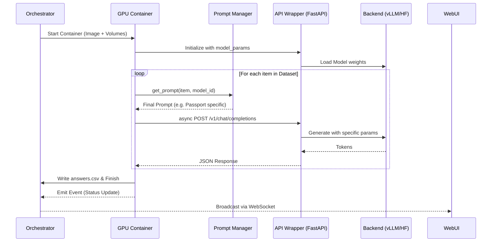
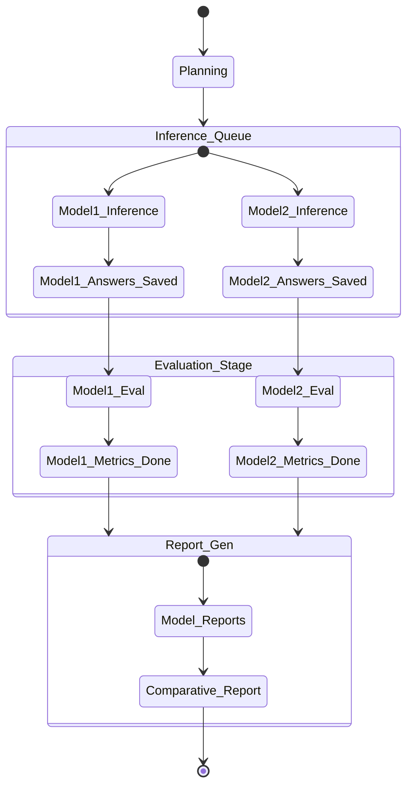
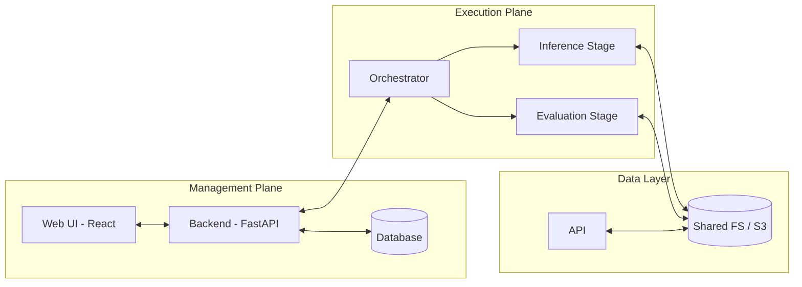
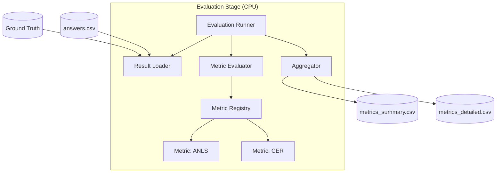

# Архитектурный план VLMHyperBench v0.2.0

Этот план описывает обновленную структуру модулей и методов для проведения оценки моделей Qwen3-VL 4b и DeepSeek-OCR 3b. Основной упор сделан на асинхронность, расширяемость через специфичные настройки и гибкое управление промптами.

## 1. Обзор архитектуры

Система строится на взаимодействии трех основных слоев:
1.  **Orchestration Layer**: Планирует задачи и управляет контейнерами.
2.  **Inference Layer (API Wrapper)**: Обеспечивает унифицированный доступ к моделям.
3.  **Execution Layer**: Проводит расчет метрик.

## 2. Модульная структура и методы

### 2.0. Orchestration Layer (Benchmark Lifecycle)
Управляет планированием и мониторингом всех этапов.

#### Класс `BenchmarkPlanner`
*   Парсит конфиг и строит граф задач.
*   Определяет возможности параллельного запуска (например, Inference на разных GPU).

#### Класс `TaskTracker`
*   Мониторинг статуса выполнения каждого этапа:
    *   `Inference [Model 1]`: Success / Failed
    *   `Evaluation [Model 1]`: Pending / Success
    *   `Reporting [Summary]`: Waiting for Model 2
*   Позволяет перезапускать только упавшие или новые этапы (Incremental Runs).

#### 2.0.1. Monitoring & Observability (Dashboard)
*   **Event-Driven Monitoring**: Оркестратор эмитит события о начале/конце каждой задачи.
*   **Web UI (Port 8050)**: Визуализация прогресса, текущих метрик и логов инференса в реальном времени.
*   **Resource Tracking**: Мониторинг потребления ресурсов GPU ворверами.

### 2.1. Inference Layer (API Wrapper)
Центральный компонент для унификации инференса.

#### Класс `APIWrapper` (FastAPI)
*   `async __init__(backend_config: BackendConfig)`
*   `async post_chat_completions(request: OpenAIRequest) -> OpenAIResponse`: Основной эндпоинт. Поддерживает поле `response_format` для структурированного вывода.
*   `async get_metrics() -> Dict[str, float]`: Возвращает TTFT, TPOT и использование памяти.

#### Класс `BackendAdapter` (Abstract Base Class)
*   `async generate(prompt: str, images: List[Image], params: Dict[str, Any]) -> str`
*   `_apply_special_settings(settings: Dict[str, Any])`: Метод для применения специфичных настроек.
*   `_setup_constrained_decoding(schema: Dict)`: Внутренний метод для настройки ограничений генерации (JSON Schema/Regex).

#### Реализации адаптеров:
*   `vLLMAdapter`: Интеграция с `vllm.LLM` или `vLLM OpenAI Server`.
*   `SGLangAdapter`: Взаимодействие с `sgl-server`.
*   `HuggingFaceAdapter`: Для моделей, требующих кастомных лоадеров (DeepSeek-OCR).

### 2.2. Execution Layer (Client Side)
Скрипты, работающие внутри контейнера и взаимодействующие с API Wrapper.

#### Класс `AsyncDatasetRunner`
*   `async run()`: Основной цикл прогона.
*   `async _process_item(item: DatasetItem)`: Асинхронная обработка одной записи с использованием `PromptManager`.
*   `save_results(path: str)`: Синхронное сохранение CSV.

### 2.3. Prompt Management Layer
Новый компонент для гибкого управления промптами.

#### Класс `PromptManager`
*   `get_prompt(item: DatasetItem, model_id: str) -> str`: Возвращает финальный промпт-вопрос для конкретного объекта.
*   `get_system_prompt(item: DatasetItem, model_id: str) -> str`: Возвращает системный промпт.
*   **Логика выбора (для обоих типов промптов)**:
    1.  **Override**: Если указан `fixed_prompt` или `fixed_system_prompt` для модели — используется он.
    2.  **Mapping**: Если есть `prompt_collection` (словарь `type -> prompt`), выбирается промпт по типу документа из `item.metadata`.
    3.  **Fallback**: Если ничего не задано, берется значение по умолчанию (из датасета или пустая строка).

### 2.4. Evaluation Layer (Metric Calculation)
Изолированный этап для расчета метрик по готовым ответам. Поддерживает сложную логику для структурированных данных.

#### Класс `DataParser`
*   `parse(raw_text: str, schema: Optional[Dict] = None) -> Dict[str, str]`:
    1. Извлекает JSON из `raw_text`.
    2. Если задана `schema`, выполняет валидацию (через **Pydantic**).
    3. При ошибке валидации помечает объект флагом `is_invalid_structure = True`.

#### Класс `MetricEvaluator`
*   `evaluate_item(pred_raw, gt_raw)`:
    1. Вызывает `DataParser` для предикта и GT.
    2. Выполняет выравнивание полей (Field Alignment).
    3. Для каждого поля вызывает соответствующую метрику из `MetricRegistry`.
*   `evaluate_batch(preds, gts)`: Пакетная обработка.

#### Класс `MetricRegistry`
*   Динамическая загрузка классов метрик по имени из конфига.
*   Поддержка версионирования метрик (например, `ANLS_v1`, `ANLS_v2`).

#### Иерархия Метрик (`BaseMetric`)
*   **TextMetric**: Сравнение строк (CER, WER, ANLS). Включает настраиваемую нормализацию.
*   **FieldMetric**: Сравнение структур данных (JSON/Dict). Считает полноту извлечения полей.
*   **StructuralFidelity**: Метрика валидности формата (0 или 1). Позволяет оценить надежность структурированного вывода.
*   **ClassificationMetric**: Для задач классификации (Accuracy, F1).

#### Класс `Aggregator`
*   **Стратегии агрегации**:
    *   `by_id`: Детальный отчет по каждому объекту (предикты, GT, метрики). Позволяет выявлять конкретные ошибки модели.
    *   `by_category`: Группировка по `doc_type`, `field_name` или `question_type`.
    *   `general`: Агрегация в единую цифру по всему датасету (Mean/Median/Std) для сравнительного анализа.
*   **Выход**: Генерация сводных таблиц и JSON-отчетов для дашбордов.

## 3. Взаимодействие компонентов



### 3.2. Benchmark Lifecycle (State Machine)



### 3.3. Platform Architecture Diagram



### 3.4. Evaluation Flow (Independent Stage)



## 4. Специфичные настройки моделей (Extensibility)

Для максимальной гибкости все настройки инференса объединяются в словарь `model_params`. Это позволяет передавать любые параметры, включая настройки структурированного вывода (`response_format`).

```json
{
  "model_params": {
    "model_name": "deepseek-ai/DeepSeek-OCR",
    "ngram_size": 30,
    "window_size": 90,
    "use_flash_attn": true,
    "trust_remote_code": true,
    "response_format": {
      "type": "json_schema",
      "schema": {
        "type": "object",
        "properties": {
          "name": {"type": "string"},
          "id_number": {"type": "string"},
          "expiry_date": {"type": "string"}
        },
        "required": ["name", "id_number"]
      }
    }
  },
  "prompt_config": {
    "system_prompt": "You are a helpful OCR assistant.",
    "override_prompt": "Extract fields from this document:",
    "type_mapping": {
      "passport": {
        "system_prompt": "You are a specialized passport recognition agent.",
        "user_prompt": "Extract Name, Number, and Date from this passport:"
      },
      "invoice": {
        "user_prompt": "List all items and total amount from this invoice:"
      }
    }
  }
}
```

## 5. Docker образы (Фиксация версий)

Для обеспечения воспроизводимости мы используем конкретные теги образов:

*   **vLLM**: `vllm/vllm-openai:v0.7.2`
*   **SGLang**: `sglang/sglang:v0.4.1`
*   **Hugging Face (Custom)**: Собираем свой образ `vlmhyperbench/vlm-base-hf:cu124-py310-torch2.5`.
    *   *Основа*: `nvidia/cuda:12.4.1-devel-ubuntu22.04`
    *   *Ключевые зависимости*: `torch==2.5.1`, `transformers>=4.48.0`, `flash-attn>=2.7.0`.

## 6. План действий (Todo)

1.  [ ] Создать `packages/prompt_manager` для реализации логики выбора промптов.
2.  [ ] Реализовать `APIWrapper` (FastAPI) с поддержкой `model_params`.
3.  [ ] Подготовить `DeepSeekAdapter` с поддержкой специфичных для OCR настроек.
4.  [ ] Обновить `run_vlm.py` для асинхронной работы с `PromptManager`.
5.  [ ] Протестировать на `demo_mini` с маппингом промптов для разных типов документов.
