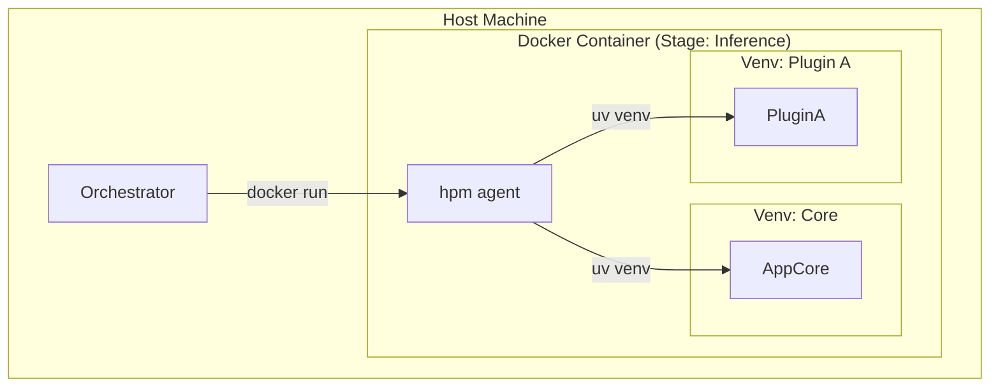

# Стратегия изоляции окружений в HyperPackageManager (hpm)

## 1. Введение

Одной из главных задач `hpm` является обеспечение возможности запуска композитных приложений, части которых могут иметь конфликтующие зависимости. Для этого нам нужна гибкая стратегия изоляции, которая работает как на уровне процессов (venv), так и на уровне контейнеров (Docker/Singularity).

## 2. Уровни изоляции

Мы выделяем два принципиально разных уровня изоляции, которые `hpm` должен поддерживать:

### 2.1. Уровень 1: Python Environment Isolation (Lightweight)
*   **Технология:** `uv venv` (виртуальные окружения).
*   **Сценарий:** Запуск нескольких плагинов, которые конфликтуют по python-пакетам (например, `numpy<2` vs `numpy>=2`), но могут работать в одной ОС.
*   **Реализация:**
    *   `hpm` создает несколько папок `.venv_A`, `.venv_B`.
    *   Запускает процессы с разными `VIRTUAL_ENV` переменными.
    *   Взаимодействие через IPC (Socket, Redis, HTTP) или Subinterpreters (Python 3.14+).

### 2.2. Уровень 2: System Container Isolation (Heavyweight)
*   **Технология:** Docker, Singularity, Podman.
*   **Сценарий:**
    *   Конфликт системных библиотек (CUDA 11.8 vs CUDA 12.1).
    *   Требование полной изоляции файловой системы (безопасность).
    *   Запуск на удаленных кластерах (HPC, K8s).
*   **Реализация:**
    *   `hpm` генерирует `Dockerfile` или `Singularity.def` на лету.
    *   Или использует готовые базовые образы и устанавливает туда пакеты python.

## 3. Гибридная модель (The "Matryoshka" Approach)

`hpm` должен уметь работать вложенно.

**Сценарий:** Оркестратор запускает Docker-контейнер (Уровень 2), внутри которого `hpm` создает виртуальное окружение (Уровень 1) для конкретного плагина.



## 4. Абстракция "Environment Runtime"

Чтобы не привязываться к конкретной технологии, мы вводим абстракцию `Runtime`. В манифесте `hpm.yaml` (или в профиле запуска) можно указать требуемый тип изоляции.

```yaml
# hpm.yaml
runtime:
  type: "docker" # или "venv", "singularity", "process"
  base_image: "nvidia/cuda:12.1-base"
```

### 4.1. Поддерживаемые рантаймы

1.  **Local Venv:**
    *   Самый быстрый старт.
    *   Идеально для разработки (`hpm run`).
    *   Использует `uv` для создания venv.

2.  **Docker / Podman (hpm as Entrypoint):**
    *   **Концепция:** Вместо жесткого `CMD ["python", "main.py"]`, контейнер запускается через `ENTRYPOINT ["hpm", "entrypoint"]`.
    *   **Workflow при старте:**
        1.  **Bootstrap:** `hpm` проверяет переменные окружения (`RUN_MODE`, `HPM_PLUGINS`).
        2.  **Resolution:** Если `RUN_MODE=dev`, он монтирует локальные плагины (через volume, проброшенный оркестратором).
        3.  **JIT Install:** Выполняет быструю доустановку недостающих пакетов (`uv sync`). В контейнере это занимает секунды благодаря кэшу.
        4.  **Exec:** Только после успешной подготовки окружения `hpm` передает управление целевому процессу (`exec "$@"`).
    *   **Преимущество:** Контейнер становится "полиморфным". Один и тот же образ `base-gpu` может стать `vqa-worker` или `ocr-worker` в зависимости от аргументов запуска, без пересборки.

3.  **Singularity (Apptainer):**
    *   Критично для HPC (High Performance Computing).
    *   `hpm` инициирует процесс конвертации Docker-образов в SIF (через вызов `singularity build`).

## 5. Решение для VLMHyperBench

Для нашего проекта мы выбираем следующую стратегию:

1.  **Orchestrator** управляет **Уровнем 2 (Контейнеры)**. Он решает, что для этапа `Inference` нужен контейнер с GPU.
2.  **HPM** внутри контейнера управляет **Уровнем 1 (Venv)**. Он устанавливает пакеты в системный python (если контейнер одноразовый) или создает venv (если нужно изолировать плагины внутри одного контейнера).

Это позволяет нам сохранить простоту: Оркестратор не думает о venv, а HPM не думает о том, как поднять Docker (он уже внутри).