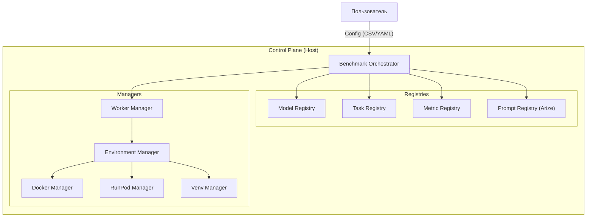
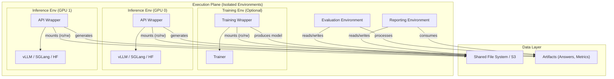

# Спецификация Архитектуры VLMHyperBench (Final)

## 1. Концептуальная Архитектура (High-Level)

VLMHyperBench — это модульный, расширяемый фреймворк для оценки VLM, построенный на принципах **микросервисной архитектуры** и **изоляции окружений**.

### 1.1. Ключевые принципы
1.  **Everything is a Registry**: Модели, Задачи, Метрики, Датасеты — все это сущности, регистрируемые в системе.
2.  **Environment Agnostic**: Код этапа (Stage) не зависит от того, где он выполняется (локальный Docker, удаленный Pod, Singularity).
3.  **Dynamic Dependency Injection**: Необходимые пакеты (драйверы моделей, метрики) устанавливаются в контейнер "на лету" (Just-In-Time).
4.  **Backend Abstraction**: Единый интерфейс для HuggingFace, vLLM, SGLang.

---

## 2. Компонентная Модель (C4 Container Diagram)

### 2.1. Диаграмма Компонентов (Control Plane)

### 2.2. Диаграмма Исполнения (Execution Plane & Data)

---

## 3. Детальное проектирование подсистем

### 3.1. Подсистема управления окружением и воркерами

#### 3.1.1. Worker Manager
Отвечает за распределение задач по доступным ресурсам.
*   **Функции**:
    *   Обнаружение доступных GPU (локально или в кластере).
    *   Создание пула воркеров (Worker Pool).
    *   Назначение задач (Evaluation Runs) свободным воркерам.
    *   Мониторинг состояния воркеров.

#### 3.1.2. EnvManager
Абстрагирует жизненный цикл изолированной среды.

*   **Интерфейс `EnvManager`**:
    *   `setup(requirements: List[str])`: Подготовка окружения (установка пакетов).
    *   `run(command: str, volumes: Dict)`: Запуск команды с монтированием данных.
    *   `cleanup()`: Освобождение ресурсов.
    *   `mount_data(data_paths: Dict)`: Монтирование общих данных (Shared Storage).

*   **Реализации**:
    *   `DockerEnvManager`: Использует Docker API. Для доступа к данным использует `volumes` (bind mounts).
    *   `SingularityEnvManager`: Конвертирует Docker image в SIF и запускает.
    *   `RunPodEnvManager`: Арендует Pod, синхронизирует данные (rsync/S3), запускает задачу.
    *   `LocalVenvManager`: Создает временный venv (для отладки).

### 3.2. Подсистема Инференса (Model Interface)
Унифицирует работу с разными бэкендами.

*   **Интерфейс `VLMInterface`**:
    *   `load_model(config)`: Загрузка весов.
    *   `generate(prompts, images, generation_config)`: Генерация ответов.

*   **Адаптеры**:
    *   `HuggingFaceAdapter`: `AutoModelForVision2Seq`.
    *   `vLLMAdapter`: `vllm.LLM` с поддержкой batching.
    *   `SGLangAdapter`: Клиент к SGLang server.

*   **Стратегия взаимодействия (Inference API Wrapper)**:
    *   **Wrapper**: Все бэкенды (vLLM, SGLang, HF) оборачиваются в унифицированный **FastAPI Proxy**.
    *   **Функции Wrapper'а**:
        *   Предоставляет единый API (`/v1/chat/completions`).
        *   Измеряет метрики производительности (TTFT, TPOT, Latency, Peak Memory) на стороне воркера.
        *   Возвращает метрики вместе с ответом модели.
    *   **Orchestrator**: Получает ответ и сохраняет метрики без необходимости внешнего мониторинга.

### 3.3. Подсистема Задач и Метрик (Task & Metric Registries)
Позволяет гибко добавлять новые типы задач без изменения ядра.

*   **Task Registry**:
    *   Определяет формат `DatasetIterator` (как читать данные).
    *   Определяет `PromptStrategy` (как формировать промпт).
*   **Metric Registry**:
    *   Содержит реализацию метрик (ANLS, Accuracy, BLEU).
    *   Позволяет динамически подгружать код метрик (например, из git-repo).

### 3.4. Подсистема Агрегации и Отчетов
Обеспечивает многоуровневый анализ.

*   **MetricAggregator**:
    *   Вход: `metrics.csv` (по каждому примеру).
    *   Конфиг: Группировка по колонкам (например, `doc_type`, `field_name`).
    *   Выход: Сводные таблицы.
*   **ReportGenerator**:
    *   Рендеринг Markdown/HTML отчетов с графиками (matplotlib/seaborn).

---

## 4. Сценарий выполнения (Workflow)

1.  **Initialization**:
    *   Оркестратор читает `user_config.csv`.
    *   Разрешает зависимости через Реестры (какой контейнер, какие пакеты, какой адаптер).
2.  **Environment Setup**:
    *   `EnvManager` поднимает контейнер (или Pod).
    *   **Dynamic Install**: Внутри контейнера выполняется установка специфичных пакетов (драйвер модели, метрики).
        *   Поддержка как `pip install`, так и `uv pip install` (если `uv` доступен в контейнере для ускорения).
3.  **Training Stage (Optional)**:
    *   Запуск обучения модели (fine-tuning) в отдельном контейнере.
    *   Артефакт: веса модели, сохраненные на Shared FS.
4.  **Inference Stage**:
    *   Запуск `run_vlm.py` внутри контейнера.
    *   `PromptHandler` забирает актуальные промпты из `PromptRegistry` (Arize Phoenix).
    *   Генерация `answers.csv`.
5.  **Evaluation Stage**:
    *   Поднятие легкого CPU-контейнера.
    *   Запуск `run_eval.py`.
    *   Расчет метрик -> `metrics.csv`.
6.  **Reporting Stage**:
    *   Агрегация метрик.
    *   Генерация `final_report.md`.

---

## 5. Технологический стек (Recommended)
*   **Core**: Python 3.10+, Pydantic (валидация конфигов).
*   **Containerization**: Docker SDK, Singularity (via subprocess).
*   **Cloud**: RunPod API / SkyPilot (опционально).
*   **Data**: Pandas, Polars (для быстрой обработки CSV).
*   **Tracking**: Arize Phoenix (промпты), MLflow/WandB (метрики - опционально).
*   **Inference**: vLLM, Transformers, SGLang.