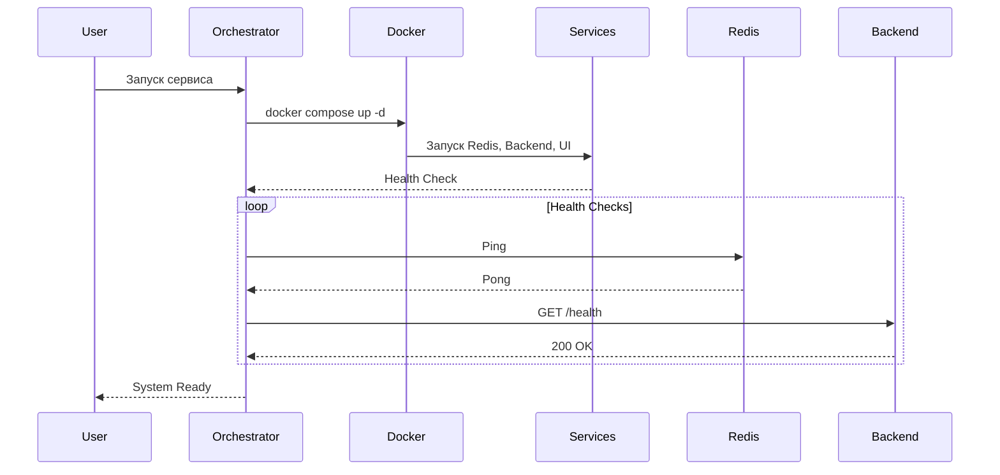
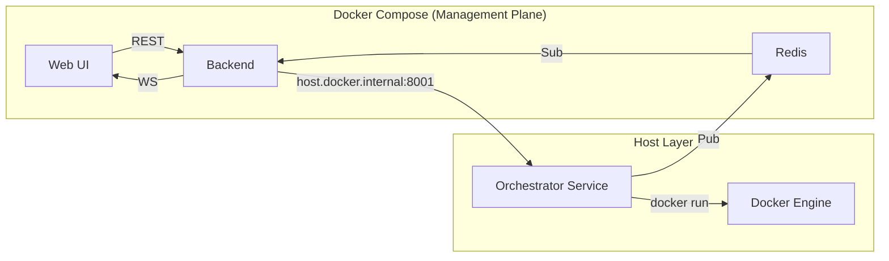

<write_to_file>
<path>plans/management_backend_architecture_summary.md</path>
<content>
# Архитектура Management Plane и Orchestrator Service

**Дата**: 2026-01-22
**Задача**: Реализация Management Backend (FastAPI) и Orchestrator Service для VLMHyperBench v0.2.0

---

## 1. Ключевое архитектурное решение

**Гибридная архитектура (Host + Containers)**:
- **Orchestrator Service** работает на **хосте** (Host Layer)
- **Management Plane** (Backend, UI, Redis) работает в **контейнерах** (Container Layer)
- **Оркестратор** управляет инфраструктурой через Docker Compose

### Почему так?

1. **Безопасность**: Оркестратор на хосте имеет прямой доступ к `/var/run/docker.sock` и GPU без проброса сокета в контейнер (избегаем Docker-in-Docker).
2. **Изоляция**: Backend и UI изолированы в контейнерах с собственными зависимостями.
3. **Упрощение развертывания**: Оркестратор является "единой точкой входа" — он сам поднимает всю инфраструктуру.

---

## 2. Структура проекта

```
vlmhyperbench_playground/
├── packages/                      # Общие библиотеки (viral modularity)
│   ├── orchestrator_core/         # AsyncBenchmarkOrchestrator, EventBus, ResourceManager
│   ├── data_layer/               # Smart Sync, S3/Local Storage
│   └── metric_registry/          # Реестр метрик
│
├── services/                     # Исполняемые сервисы
│   ├── management_backend/        # FastAPI (в контейнере)
│   │   ├── Dockerfile
│   │   ├── pyproject.toml
│   │   └── src/
│   │       ├── api/             # REST endpoints
│   │       ├── models/          # SQLAlchemy models
│   │       ├── schemas/         # Pydantic schemas
│   │       └── core/           # Config, DB
│   │
│   ├── orchestrator_service/      # API-обертка (на хосте)
│   │   ├── pyproject.toml
│   │   └── src/
│   │       └── main.py         # FastAPI для управления оркестратором
│   │
│   └── web_ui/                 # React Dashboard (в контейнере)
│       ├── Dockerfile
│       └── src/
│
└── docker-compose.yaml           # Определение Management Plane (Backend, Redis, UI)
```

---

## 3. Поток запуска (Bootstrapping)

### Инициализация (Orchestrator Service)

1. **Запуск**: Пользователь запускает `orchestrator_service` на хосте.
2. **Health Check**: Оркестратор проверяет доступность Docker Engine.
3. **Docker Compose**: Оркестратор запускает `docker-compose up -d` для Management Plane.
   - Поднимает **Redis** (порт 6379)
   - Поднимает **Backend** (FastAPI, порт 8000)
   - Поднимает **Web UI** (React, порт 3000)
4. **Wait Loop**: Оркестратор ждет, пока все сервисы пройдут Health Check.
5. **Ready**: Если все сервисы поднялись — оркестратор готов к работе.
6. **Error Handling**: Если какой-то сервис не поднялся — логируется ошибка, оркестратор сообщает о проблеме.



---

## 4. Взаимодействие компонентов

### Связь "Контейнер -> Хост"

- **Backend** (в контейнере) обращается к **Orchestrator** (на хосте) через специальный DNS:
  - URL: `http://host.docker.internal:8001`
  - Это работает в Docker Desktop и на Linux с `--add-host=host.docker.internal:host-gateway`

### Связь через Redis (Event Bus)

- **Orchestrator** публикует события в Redis (Pub/Sub).
- **Backend** подписывается на Redis и пробрасывает события в **Web UI** через WebSockets.



---

## 5. API Эндпоинты

### Orchestrator Service (Host:8001)

- `POST /run` — Запуск эксперимента
  - Принимает конфигурацию (RunTask)
  - Добавляет задачи в TaskGraph
  - Запускает AsyncBenchmarkOrchestrator

- `GET /status/{run_id}` — Статус выполнения
  - Возвращает статус задач (PENDING, RUNNING, COMPLETED, FAILED)

- `GET /resources` — Состояние GPU ресурсов
  - Свободные/занятые GPU

### Management Backend (Container:8000)

- `POST /experiments` — Создание эксперимента
  - Сохраняет конфиг в БД
  - Делает запрос к Orchestrator: `POST /run`

- `GET /experiments` — Список экспериментов
- `GET /experiments/{id}` — Детали эксперимента
- `GET /analytics/{id}` — Данные для графиков (Plotly JSON)
- `WS /ws/{experiment_id}` — Real-time обновления статуса

---

## 6. Технологический стек

### Orchestrator Service (Host)
- **Python 3.13+**
- **FastAPI** (для HTTP API управления)
- **aiodocker** (для Docker API)
- **Redis** (pub/sub для событий)
- **orchestrator_core** (библиотека из packages/)

### Management Backend (Container)
- **Python 3.13+**
- **FastAPI** (REST API)
- **SQLAlchemy / SQLModel** (ORM)
- **SQLite** (разработка) / **PostgreSQL** (продакшн)
- **Redis** (подписка на события)
- **WebSockets** (для UI)

### Web UI (Container)
- **React**
- **Plotly** (визуализация)
- **WebSocket Client** (реальные обновления)

---

## 7. Best Practices (из исследования Tavily)

1. **Separation of Concerns**: Четкое разделение между Control Plane (Host) и Management Plane (Containers).
2. **Health Checks**: Каждый сервис должен иметь `/health` эндпоинт.
3. **Event-Driven Architecture**: Использование Redis для асинхронной передачи событий.
4. **Viral Modularity**: Общие библиотеки в `packages/`, сервисы в `services/`.
5. **Docker Compose**: Для управления инфраструктурой (но не для оркестратора).

---

## 8. Следующие шаги (Implementation)

1. [ ] Создать структуру `services/management_backend`
2. [ ] Создать структуру `services/orchestrator_service`
3. [ ] Реализовать `docker-compose.yaml` (Backend, Redis, UI)
4. [ ] Реализовать `orchestrator_service` с логикой запуска docker-compose
5. [ ] Реализовать Health Checks для всех сервисов
6. [ ] Интегрировать EventBus через Redis
7. [ ] Написать тесты для проверки связи между компонентами
8. [ ] Обновить документацию и Memory Bank

---

## 9. Open Questions

- [ ] Использовать SQLite для старта или сразу PostgreSQL?
- [ ] Как хранить конфигурации экспериментов (в БД или в YAML)?
- [ ] Нужна ли аутентификация в Backend на старте?

---

## 10. Ссылки

- [`plans/task_05_management_backend.md`](task_05_management_backend.md) — Задача Backend
- [`plans/task_12_component_placement.md`](task_12_component_placement.md) — Стратегия размещения
- [`packages/orchestrator_core/`](../packages/orchestrator_core/) — Ядро оркестрации
</content>
</write_to_file>